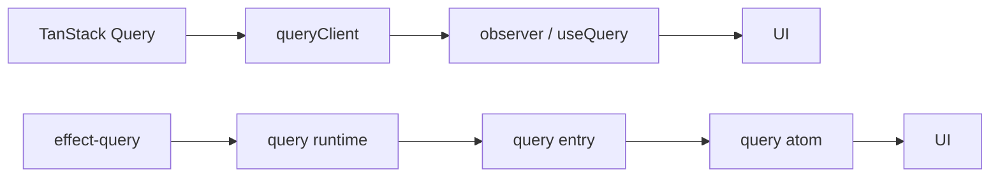

# How TanStack Query concepts map to `effect-query`

If you already know TanStack Query, the hard part of `effect-query` is not the
problem space. It is the shift in what counts as the center of the API.

TanStack Query teaches a useful set of server-state ideas: cache identity,
staleness, retries, invalidation, hydration, refetch triggers, and mutation
workflows. `effect-query` keeps those ideas, but it routes them through Effect,
query atoms, mutation atoms, and the query runtime instead of a client-plus-hook
surface.

This guide is for people who already have TanStack Query instincts and want to
know where those instincts still apply, where the library intentionally differs,
and where the current gaps still are.

## The main shift: atoms are the read model

TanStack Query usually starts from a client and observers:

- `queryClient`
- `useQuery(...)`
- `useMutation(...)`

`effect-query` starts from a query runtime and atoms:

- `makeRuntime(...)`
- `createQueryAtom(...)`
- `createQueryAtomFactory(...)`
- `createMutationAtom(...)`
- `createMutationAtomFactory(...)`

That sounds cosmetic until you feel what it changes. In TanStack Query,
components subscribe through observers hanging off a central client. In
`effect-query`, the thing your UI reads is already an atom.



The difference is not just vocabulary. It changes the reactive shape of the
whole library.

## The same problem space, a different center of gravity

`effect-query` is still about remote state:

- cached data is not the same thing as local UI state
- stale data needs refetch rules
- writes need invalidation and update hooks
- server rendering needs `hydrate(...)` and `dehydrate(...)`

What changes is the center of gravity:

- query state is read through **query atoms** and **query atom factories**
- async work is expressed as `Effect`, not `Promise`
- invalidation is driven by **reactivity keys**
- the query runtime orchestrates work, but the UI subscribes per entry

That makes the library feel more Effect-native than React-client-native, even
when it is solving the same class of problems as TanStack Query.

## Important defaults still matter

TanStack Query is opinionated about defaults. `effect-query` keeps that spirit.

- `staleTime` controls freshness
- `gcTime` controls retention
- `refetchOnMount`, `refetchOnWindowFocus`, and `refetchOnReconnect` control
  automatic refetches

The difference is where those defaults live. In TanStack Query they feel like
client policy. In `effect-query` they feel like query-runtime policy plus
per-entry atom behavior.

## Queries: one entry, one query atom

TanStack Query has one conceptual unit: a query observer around a query key.

`effect-query` splits that into two explicit concepts:

- a **query atom** for one cache entry
- a **query atom factory** for a parameterized family of entries

```ts
const userQuery = createQueryAtomFactory({
  queryKey: (userId: string) => ["user", userId],
  queryFn: (userId: string) => fetchUser(userId),
});

const userAtom = userQuery("1");
```

TanStack Query can express the same underlying idea. `effect-query` just makes
the reactive value first-class instead of treating it as an observer hanging off
somewhere else.

## Query keys still identify cache entries

This part should feel familiar.

- `queryKey` identifies cached data
- it is hashed for lookup
- different arguments produce different query entries

The twist is that cache identity is not the whole invalidation story. Query keys
identify entries; **reactivity keys** identify invalidation relationships.

## Query functions speak `Effect`

This is where the library stops feeling like a small wrapper around TanStack
Query and starts feeling like its own thing.

TanStack Query query functions return promises. `effect-query` query functions
return `Effect`.

```ts
const userQuery = createQueryAtomFactory({
  queryKey: (userId: string) => ["user", userId],
  queryFn: (userId: string, { queryKey, signal }) =>
    UserApi.use((api) => api.fetchUser(userId, { queryKey, signal })),
});
```

That buys a few things immediately:

- query work can depend on services and layers naturally
- retries compose as `Schedule`
- cancellation can follow `AbortSignal` and fiber interruption
- request logic stays in one execution model instead of bouncing in and out of
  promise wrappers

## Query options are familiar on purpose

The option names are intentionally close to TanStack Query:

- `queryKey`
- `queryFn`
- `staleTime`
- `gcTime`
- `enabled`
- `refetchInterval`
- `initialData`
- `placeholderData`
- `networkMode`

That familiarity is useful because the concepts are useful. The semantic shift
is that the option object feeds a query atom or query atom factory, not a React
hook call.

## Network mode is the same feature in a different engine

`networkMode` exists because online/offline behavior matters no matter which
library you use.

`effect-query` currently supports:

- `"online"`
- `"always"`
- `"offlineFirst"` is still partial

The user-facing concept is the same as TanStack Query. The implementation is
different in flavor: connectivity behavior is handled by the query runtime and
its entries rather than by hook-level observer policy.

The concept tests back this up:

- when `networkMode` is `"online"`, fetches pause while offline and resume on
  reconnect
- when it is `"always"`, fetches keep running even while offline

## Parallel queries do not need a special composition primitive

TanStack Query makes parallel fetching feel natural through multiple hook calls
or `useQueries(...)`.

`effect-query` gets parallelism from the atom model itself:

- read multiple query atoms side by side
- or compose them into one larger atom
- each query atom still subscribes only to its own entry

In React, the straightforward version is already enough:

```tsx
function Screen({ userId, projectId }: Props) {
  const user = useAtomValue(userQuery(userId));
  const project = useAtomValue(projectQuery(projectId));

  if (user.isPending || project.isPending) {
    return <Spinner />;
  }

  return (
    <>
      {user.data && <UserCard user={user.data} />}
      {project.data && <ProjectCard project={project.data} />}
    </>
  );
}
```

If you want one `useAtomValue(...)`, compose the query atoms first:

```tsx
import * as Atom from "effect/unstable/reactivity/Atom";

function Screen({ userId, projectId }: Props) {
  const screenAtom = React.useMemo(
    () =>
      Atom.readable((get) => ({
        user: get(userQuery(userId)),
        project: get(projectQuery(projectId)),
      })),
    [userId, projectId],
  );

  const { user, project } = useAtomValue(screenAtom);

  if (user.isPending || project.isPending) {
    return <Spinner />;
  }

  return (
    <>
      {user.data && <UserCard user={user.data} />}
      {project.data && <ProjectCard project={project.data} />}
    </>
  );
}
```

So the rule of thumb is simple: the atom layer is already the composition layer.

## Dependent queries can use `enabled`, but they do not stop there

TanStack Query often models dependent queries with `enabled`. That pattern still
works here:

```ts
const userQuery = createQueryAtomFactory({
  queryKey: (id: string) => ["user", id],
  queryFn: (id: string) => fetchUser(id),
});

const projectsQuery = createQueryAtomFactory({
  queryKey: (userId: string) => ["projects", userId],
  enabled: (userId: string | undefined) => userId !== undefined,
  queryFn: (userId: string) => fetchProjectsForUser(userId),
});
```

But atoms give you a second option when the dependency is really part of your
reactive model:

```tsx
import * as Atom from "effect/unstable/reactivity/Atom";

function Screen({ email }: Props) {
  const screenAtom = React.useMemo(
    () =>
      Atom.readable((get) => {
        const user = get(userByEmailQuery(email));

        if (user.data === undefined) {
          return { user, projects: undefined };
        }

        return {
          user,
          projects: get(projectsQuery(user.data.id)),
        };
      }),
    [email],
  );

  const { user, projects } = useAtomValue(screenAtom);

  if (user.isPending) {
    return <Spinner />;
  }
  if (user.isError) {
    return <ErrorView />;
  }
  if (projects?.isPending) {
    return <Spinner />;
  }

  return <ProjectsList projects={projects?.data ?? []} />;
}
```

That is a good example of the broader design: `enabled` still exists, but it is
not the only way to describe dependency.

## Status and background fetching stay explicit

The query result surface tracks the distinctions you care about:

- `status`
- `fetchStatus`
- `isPending`
- `isSuccess`
- `isError`
- `isFetching`
- `isRefetching`
- `data`
- `error`
- `failureCause`
- `dataUpdatedAt`

The important part is not just the field list. It is that this result hangs off
an atom rather than off a hook observer.

## Focus refetching, polling, and disabling are runtime orchestration

The familiar features are there:

- stale active queries can refetch on focus
- `refetchInterval` supports polling
- `enabled` keeps automatic work idle while disabled

What changes is the implementation boundary. The query runtime scans entries and
coordinates work. Query atoms react to entry updates. The runtime is the
orchestrator, not the main reactive surface.

That distinction matters because it keeps unrelated entries from waking each
other up. [`docs/reactive-topology.md`](./reactive-topology.md) covers that
contract directly.

## Retries use Effect schedules, not a tiny retry DSL

TanStack Query exposes retries through options like `retry` and `retryDelay`.
`effect-query` supports retries too, but the Effect-native version leans on
`Schedule`.

```ts
import * as Effect from "effect/Effect";
import * as Schedule from "effect/Schedule";
import * as Schema from "effect/Schema";
import { HttpClient, HttpClientResponse } from "effect/unstable/http";

const User = Schema.Struct({
  id: Schema.String,
  name: Schema.String,
});

const userQuery = createQueryAtomFactory({
  queryKey: (userId: string) => ["user", userId],
  retry: Schedule.recurs(3).pipe(
    Schedule.addDelay(() => "250 millis"),
  ),
  queryFn: (userId: string) =>
    HttpClient.get(`/api/users/${userId}`).pipe(
      Effect.flatMap(HttpClientResponse.schemaBodyJson(User)),
    ),
});
```

That keeps retry policy in the same language as the rest of your Effect
program. You do not drop into a smaller built-in callback DSL just to express
timing.

## Placeholder data, initial data, and pagination are all there, but not equally polished

Several TanStack Query concepts already map well:

- `initialData` and `initialDataUpdatedAt` seed shared query entries
- `placeholderData` is shown during the initial fetch without persisting to the
  cache
- paginated queries work naturally through query atom factories

The tests confirm the placeholder behavior: the atom can expose placeholder
data while a fetch is in flight, while `peek(...)` still sees the underlying
pending cache state.

Pagination works, but it is still lower-level than TanStack Query's dedicated
ergonomics like `keepPreviousData`.

## Infinite queries are still a real gap

This is the cleanest "not yet" in the current surface.

TanStack Query has a dedicated infinite-query model. `effect-query` does not
yet have a first-class infinite-query helper. You can build the pieces yourself
from atoms and Effect, but the library does not yet package that into one
blessed abstraction.

## Mutations are atoms too

TanStack Query splits reads and writes across `useQuery(...)` and
`useMutation(...)`. `effect-query` keeps the split in capability, but not in the
mental model.

The mutation side looks like this:

- `createMutationAtom(...)`
- `createMutationAtomFactory(...)`
- `mutationOptions(...)`

Mutation atoms expose an explicit result surface with fields like `status`,
`isPending`, `isSuccess`, `isError`, `data`, `error`, and `failureCause`.

That makes remote writes feel like part of the same reactive world as remote
reads instead of a parallel API universe.

## Invalidation is relationship-oriented

TanStack Query invalidation is usually described in terms of query filters over
query keys.

`effect-query` chooses **reactivity keys** instead.

```ts
const userQuery = createQueryAtomFactory({
  queryKey: (userId: string) => ["user", userId],
  staleTime: "1 hour",
  reactivityKeys: (userId: string) => ({
    user: [userId],
    users: ["all"],
  }),
  queryFn: (userId: string) => fetchUser(userId),
});

const usersQuery = createQueryAtom({
  queryKey: ["users"],
  staleTime: "1 hour",
  reactivityKeys: () => ({
    users: ["all"],
  }),
  queryFn: () => fetchUsers(),
});

const updateUser = createMutationAtom({
  mutationFn: (input: { readonly userId: string }) => saveUser(input),
  invalidate: (input) => ({
    user: [input.userId],
    users: ["all"],
  }),
});
```

That is a real design choice, not just a different name.

- query keys identify entries
- reactivity keys identify invalidation groupings
- mutations invalidate relationships, not ad-hoc client filters

The concept tests enforce the payoff: invalidating one relationship refreshes
the matching entries without waking unrelated ones.

## Updates from mutation responses and optimistic updates stay close to the data

The familiar moves still exist:

- `onSuccess` for follow-up work
- `setData(...)` for direct cache updates
- optimistic writes before the mutation, followed by rollback or invalidation

The difference is mostly one of feel.

- TanStack Query says "update the client cache"
- `effect-query` says "update the matching query entry that query atoms read"

That wording difference sounds small, but it keeps the entry-level reactive
model front and center.

## Cancellation is another place where Effect fits naturally

TanStack Query supports cancellation through abort-aware query functions.
`effect-query` does too:

- `queryFn` receives `signal`
- `cancel(...)` interrupts in-flight work
- interruption semantics compose with Effect directly

The tests cover both major cases:

- cancelling a refetch restores the previous successful value
- cancelling an initial fetch returns the query to its initial pending state

## Server rendering and hydration map cleanly

Hydration is one of the least surprising transitions from TanStack Query to
`effect-query`.

- `dehydrate(...)`
- `hydrate(...)`

The conceptual shift is subtle: hydration feels less like rehydrating an
external cache client and more like hydrating a reactive graph that query atoms
already read from.

## What `effect-query` does not copy on purpose

Some differences are not temporary gaps. They are deliberate choices.

### The library does not start from a client object

The query runtime exists, but it is orchestration. It is not meant to become
the one broad thing every consumer stares at.

### The library does not treat invalidation as a general-purpose filter language

Reactivity keys are narrower than TanStack Query filters and more opinionated by
design.

### The library does not hide Effect

If your app is already Effect-based, that is a feature. Query work, retries,
cancellation, and service access should stay in the same programming model.

## Trade-offs and current gaps

This approach buys a lot, but it is not free.

### What gets better

- remote state composes like the rest of an Effect Atom app
- per-entry subscriptions help avoid broad reactive churn
- retries, cancellation, and service access stay native to Effect

### What gets harder

- the library feels less instantly familiar to people who want a direct clone of
  TanStack Query's client-plus-hook API
- some ergonomics that TanStack Query has polished for years are still partial
- the docs need to teach more vocabulary because the library is not piggybacking
  on someone else's public model

### What is still missing

- first-class infinite queries
- richer aggregate helpers like `useIsFetching(...)`
- a broader SSR and router guide
- more ergonomic pagination helpers

## The short version

TanStack Query is still the right comparison because it taught the ecosystem
which server-state concepts matter.

`effect-query` agrees on the concepts:

- cache identity
- staleness
- invalidation
- hydration
- refetch triggers
- polling
- retries
- mutation workflows

It disagrees on where those concepts should live.

In `effect-query`, they belong to Effect, query atoms, mutation atoms,
reactivity keys, and the query runtime. If your app already thinks in those
terms, the library stops feeling like "TanStack Query with different imports"
and starts feeling like the server-state layer your Effect app wanted in the
first place.
