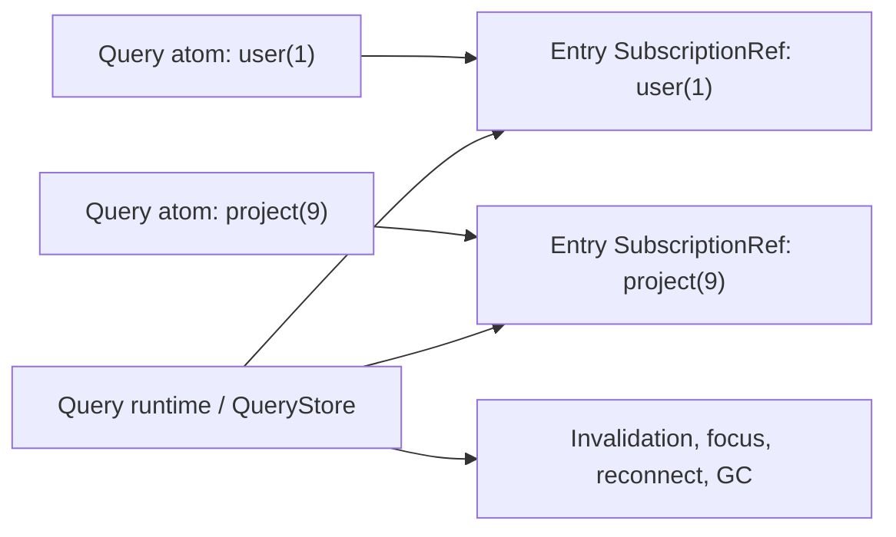

# Why The Reactive Topology Stays Per Entry

One of the easiest ways to make a query library feel fast in small demos and
weird in real apps is to put the whole runtime behind one broad reactive
surface. Then every consumer pays for changes it does not care about.

`effect-query` should not do that.

## The rule

The internal source of truth is **per-query-entry state**, not one shared
reactive snapshot for the whole query runtime.

- Each query cache entry owns its own `SubscriptionRef<QueryResult<...>>`.
- A query atom subscribes directly to the matching entry's `SubscriptionRef`.
- Unrelated query atoms should not be notified when a different query entry
  changes.

## What the query runtime still owns

The query runtime still keeps global bookkeeping. That is orchestration, not
the main thing the UI subscribes to.

- entry lookup
- invalidation scans
- focus/reconnect refetch scans
- garbage-collection scans

The runtime coordinates work across entries. Query atoms read one entry at a
time.

## Why this matters

This topology gives us the behavior we want:

- refreshing one query atom does not wake unrelated subscribers
- broad runtime state stays an implementation detail
- aggregate features can exist later without becoming the default read path

## Guardrail

[`src/EffectQuery.test.ts`](../src/EffectQuery.test.ts) includes a regression
test proving that refreshing one query atom does not notify an unrelated
subscriber.

If we add aggregate features like global fetching indicators, filters, or
devtools state, we should keep the same shape:

- small stores are the primary reactive surface
- broad snapshots are derived views, not the internal source of truth
- consumers subscribe to the narrowest store that matches the job
